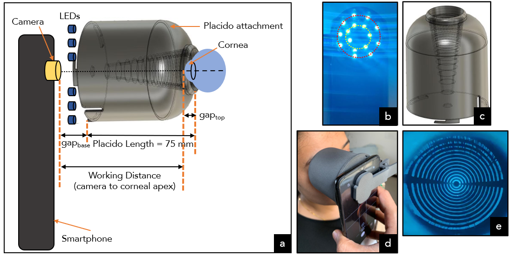
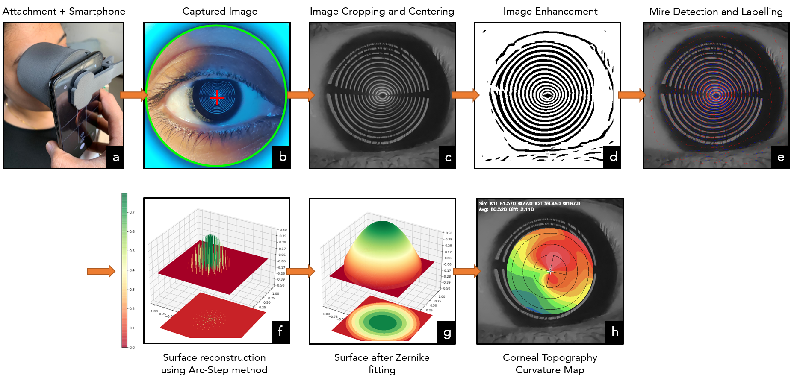
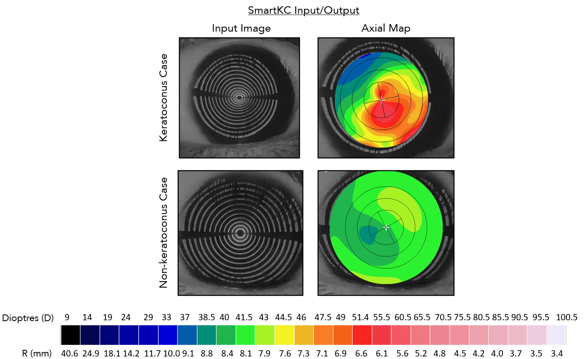

# SmartKC: Analysis Pipeline

This directory contains the code for the image processing pipeline for *SmartKC*. The input to the system is a *mire* image and the output are the corneal topography heatmaps (*axial* and *tangential*), along with the quantitative metrics: *sim-k, diff, mean-k, aCLMI, PPK, KISA*.

The aim of this README is to describe in detail the setup and image processing pipeline for ease of understanding and usage by a beginner user. The readme describes in detail the analysis pipeline, example code snippets, details on the functions and parameters.

The figure below illustrates the (a) SmartKC system setup, (b) LED light arrangement, (c) 3D-printed conical placido clip-on attachment, (d) image capture of a subject’s eye, and (e) captured image of the cornea with
placido disc reflection (called mires).

<p align='center'>
      
</p>

## Dependencies

```
* Python3.7.XX
* numpy==1.18.1
* opencv-contrib-python==4.4.0.46
* scikit-image==0.18.1
* scikit-learn
* scipy
* zernike==0.0.15
* pandas==1.1.1
* matplotlib==3.2.2
* Flask==1.1.2
* seaborn==0.11.0
* tqdm==4.56.0
* Pytorch (torch, torchvision and other dependencies for Pytorch)
```

These are all easily installable via, e.g., `pip install numpy`. Any reasonably recent version of these packages should work. It is recommended to use a python `virtual` environment to setup the dependencies and the code.

### External Libraries

* [Zernike](https://github.com/jacopoantonello/zernike)
* [Fingerprint-Enhancement-Python](https://github.com/Utkarsh-Deshmukh/Fingerprint-Enhancement-Python)

**Note**: The zernike polynomial smoothening function has been modified from the version above. Please use the module at location: `/SmartKC/data/zernike` (I yet am to make a pull request to the original repository).

## Image Processing Pipeline Overview

<p align='center'>
      
</p>


The image analysis pipeline takes as input the image collected via our setup (3D attachment and smartphone), and outputs the corneal topography heatmaps along with quantitative values. The analysis pipeline first performs **pre-processing** (*image cropping, mire segmentation, and center detection*) on the input image. The next step is to get the **mire-placido mapping**, this is followed by estimation of **placido ring location and working distance**. The final corneal topography is estimated by running the **Arc-Step method** followed by zernike polynomial based smoothening.

## Example Code Snippet:

```python
from main import *

# assuming args has camera-parameters, base_dir, start/end angle, jump, model-file, working_distance, number of mires, upsample flag

# getting parameters for corneal_top_obj
f_inv_20_5 = np.poly1d([3583.52156815, -17.31674123]) # 5 mm gap2, mire_21, id_20
sensor_dims = (
    float(args.camera_params.split()[0]),
    float(args.camera_params.split()[1]),
)  # "4.27, 5.68, 4.25"
f_len = float(args.camera_params.split()[2]) # focal length of the camera

# create the corneal_top_gen class object
corneal_top_obj = corneal_top_gen(
    args.model_file, args.working_distance, sensor_dims, 
    f_len, args.start_angle, args.end_angle, args.jump, 
    args.upsample, args.n_mires, f_inv_20_5,
    )

# get details for current test image
base_dir = args.base_dir  # base directory
skip_angles = [[-1, -1], [-1, -1]]
center = (-1, -1)
image_name = "./data/test_image.jpg"

# call function to run pipeline and generate_topography_maps
# expects image to be in .jpg format
error = corneal_top_obj.generate_topography_maps(
    base_dir,
    image_name,
    center=center,
    downsample=True,
    blur=True,
    err1=[args.gap1],
    err2=[args.gap2],
    )
```

**Note**: To understand the different parameters, please go through the detailed documentation for each function and the input parameters below.

## Running Script

`python main.py --n_mires 22 --working_distance 75.0 --camera_params "4.8 6.4 4.755" --model_file <placido_model_dimensions> --base_dir <image_dir>`

## Sample outputs

<p align='center'>
      
</p>

## About the code:

* `main.py` : This is the main runner file which has the `corneal_topography_generator` class.
* `preprocess.py` : Preprocessing module, which takes as input the mire image, performs center detection and mire segmentation.
* `mire_detection.py` : Detects the pixel locations of the mires via the *radial scanning* algorithm along with *anti-aliasing* and *outlier* removal.
* `camera_size.py`: Gets the actual 3D Placido locations using the placido model dimensions and camera parameters.
* `arc_step_method.py`: Runs the *Arc Step* method.
* `get_maps.py` : Generates the corneal topography maps from the zernike smoothened surface.
* `metrics.py` : Computes the quantitative metrics like *sim-K, aCLMI, PPK, KISA, tilt-factor*.
* `utils.py`: Contains supporting utility functions for line-plotting, drawing, etc.

### Additional Modules

* `enhance_img` : contains the src files for the mire enhancement and segmentation algorithm.
* `iris_detection` : UNet based model for iris segmentation.
* `misc_scripts` : Contains scripts for evaluation and data processing.

## Documentation

**class corneal_top_gen** : main runner class for processing the input image.

```python
corneal_top_gen(
        model_file, 
        working_distance, 
        sensor_dims,
        f_len, 
        start_angle, 
        end_angle, 
        jump, 
        upsample, 
        n_mires, 
        f_gap1, 
        zernike_degree=[8],
        test_name=None
        )
```
The class object, parameters:

* `model_file`: file which consists of the placido head dimensions
* `working_distance`: distance between camera pupil and cornea apex
* `sensor_dims` : width x height of camera sensor
* `f_len` : focal length of camera
* `f_gap1`: function which maps 1/mire-21-radius to gap1
* `start_angle`: start meridian
* `end_angle` : end meridian
* `jump`: diff between the consec angles when processing mires
* `upsample` : if the image has to be upsampled or not
* `n_mires` : number of mires to process
* `zernike_degree` : degree of the zernike polynomial used for fitting
* `test_name` : usually the date the test was conducted (all samples for that day are stored in this directory)


**generate_topography_maps**: main runner function to generate topography maps from input image.

```python
generate_topography_maps(
        base_dir, 
        image_name, 
        crop_dims=(1200,1200), 
        iso_dims=500, 
        center=(-1, -1), 
        downsample=False, 
        blur=True, 
        upsample=None,
        err1=[0], 
        err2=[0], 
        skip_angles=[[-1, -1], [-1, -1]],
        center_selection="manual",
    )
```

* `base_dir` : directory containing all the input images.
* `image_name` : test image name.
* `crop_dims` : dimensions for initial crop of the central region (this is before center detection).
* `iso_dims` : dimensions of only the central region, which is the tightest bounding box for the iris.
* `center` : center point of the mires. If this is (-1, -1) then can either select the center automatically or manually.
* `downsample` : true / false to downsample the image or not (speeds up processing of mire segmentation).
* `blur` : should blur filter be applied before mire segmentation.
* `upsample`: if the image has to be upsampled or not.
* `err1` : the value of gapTop in mm, can be positive or negative real number.
* `err2` : the value of gapBase in mm, is always a positive real number.
* `skip_angles` : the meridians to skip during processing (usually the blank spaces due to supports are ignored).
* `center_selection` : flag can be "auto" for automatic center detection or "manual" for manually selecting the center.

**run_arc_step_gen_maps** : function which runs the Arc-step method on the detected mire pixel locations, 3D placido ring locations, slope, working distance and camera parameters.

```
run_arc_step_gen_maps(
    image_seg,
    image_name,
    center, 
    coords, 
    h, w, 
    err1=0, 
    err2=0
    )
```

* `image_seg` : segmented mire image.
* `image_name` : name of input image.
* `center` : center of the mires.
* `coords` : pixel locations of the detected mires.
* `h, w` : height and width of the original un-cropped image in pixels.
* `err1` : gapTop in mm.
* `err2` : gapBase in mm


**zernike_smoothening** : function to perform zernike smoothening.

```python
zernike_smoothening(
    image_name, 
    plot_x, 
    plot_y, 
    plot_z, 
    xy_norm, 
    xv, 
    yv, 
    max_r, 
    relative_points
    )
```

* `image_name` : name of the input image
* `plot_x` : list or numpy array of the x coordinates of the corneal points fitted by Arc-step method.
* `plot_y` : list or numpy array of the y coordinates of the corneal points fitted by Arc-step method.
* `plot_z` : list or numpy array of the z coordinates (or elevation value) of the corneal points fitted by Arc-step method.
* `xy_norm` : factor to normalize x and y coordinates to lie within a unit circle.
* `xv, yv` : mesh grid for the extent of x and y.
* `max_r` : maximum radius value in pixels
* `relative_points`: relative location of each mire pixel location w.r.t to the center.

**Note** : The image processing pipeline for now only supports images with "jpg" format, and resolution of `3000x4000` pixels. For zoomed-in images please re-scale and pad accordingly before running the pipeline.

# Contributing

This project welcomes contributions and suggestions.  Most contributions require you to agree to a
Contributor License Agreement (CLA) declaring that you have the right to, and actually do, grant us
the rights to use your contribution. For details, visit https://cla.opensource.microsoft.com.

When you submit a pull request, a CLA bot will automatically determine whether you need to provide
a CLA and decorate the PR appropriately (e.g., status check, comment). Simply follow the instructions
provided by the bot. You will only need to do this once across all repos using our CLA.

This project has adopted the [Microsoft Open Source Code of Conduct](https://opensource.microsoft.com/codeofconduct/).
For more information see the [Code of Conduct FAQ](https://opensource.microsoft.com/codeofconduct/faq/) or
contact [opencode@microsoft.com](mailto:opencode@microsoft.com) with any additional questions or comments.

# Legal Notices

Microsoft and any contributors grant you a license to the Microsoft documentation and other content
in this repository under the [Creative Commons Attribution 4.0 International Public License](https://creativecommons.org/licenses/by/4.0/legalcode),
see the [LICENSE](LICENSE) file, and grant you a license to any code in the repository under the [MIT License](https://opensource.org/licenses/MIT), see the
[LICENSE-CODE](LICENSE-CODE) file.

Microsoft, Windows, Microsoft Azure and/or other Microsoft products and services referenced in the documentation
may be either trademarks or registered trademarks of Microsoft in the United States and/or other countries.
The licenses for this project do not grant you rights to use any Microsoft names, logos, or trademarks.
Microsoft's general trademark guidelines can be found at http://go.microsoft.com/fwlink/?LinkID=254653.

Privacy information can be found at https://privacy.microsoft.com/en-us/

Microsoft and any contributors reserve all other rights, whether under their respective copyrights, patents,
or trademarks, whether by implication, estoppel or otherwise.
