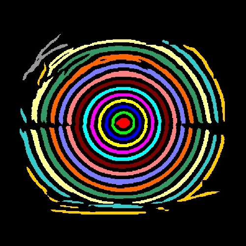

# Training the U-Net mire segmentation model

Here, we outline the steps to generate the data and train the U-Net model for mire segmentation.

## Step-1: Generate the mire masks using `mire_seg_method="img_proc"` in the main pipeline.
First, we created a data directory within the `train_unet` dir.
We put all collected images in the `images` directory within the `data` dir and run the SmartKC pipeline on the images by running:

`python main.py --n_mires 22 --working_distance 75.0 --camera_params "4.8 6.4 4.755" (or your camera params) --model_file ./data/ring_distribution.txt --base_dir ./data/images/ --center_selection auto --mire_seg_method img_proc --mire_loc_method graph_cluster --verbose`

Then, we copied the `<image_name>_seg.png` files into the `image_masks_clean` dir within the `data` dir. We removed failure cases of the image processing from this folder, and only kept clean masks.

## Step-2: Generate instance masks for mire segmentation from the generated data.
Next, we use the binary masks generated using image processing to generate the segmented mire numbers. For this, we run,

`python get_connected_components.py`

This generated instance mire masks from binary masks (see below).

 

## Step-3: Generate train/test data for training the U-Net model.
We randomly split the images in `images` dir into train/test set. (80/20 split). We generate the `train.txt` and `test.txt` file, where each line in the file is an image name.

## Step-4: Train the U-Net model
Next, we trained the U-Net model by running the following script - 

`python train.py --lr 1e-3 --num_worker 4 --batch_size 12 --epochs 1000 --start_epochs 0 --image_size 512 --train_data ../data/image_masks_clean --val_data ../data/image_masks_clean --train_txt ../data/train.txt --val_txt ../data/test.txt --train_label ../data/components --val_label ../data/components --model_path ./model_out`

We use the last `best_epoch_x_iter_y.pkl` model as the segmentation model.
